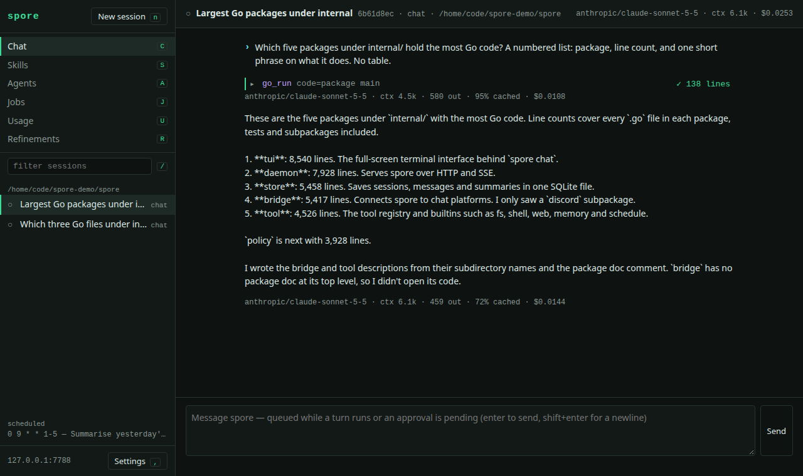
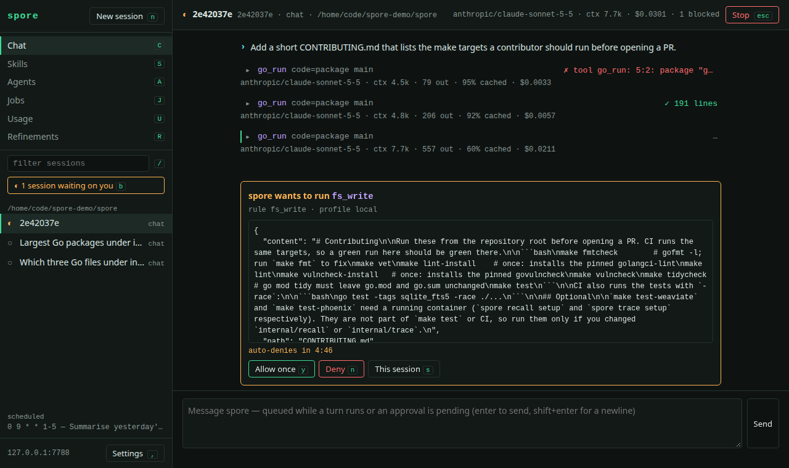

<div align="center">


# spore

**An always-on personal AI agent in a single Go binary.**<br>
Your models, your tools, your machine. Every action passes a policy engine you control.

[](https://github.com/codered/spore/actions/workflows/ci.yml)
[](https://go.dev)
[](LICENSE)
[](#-feature-tour)
[](#-installation)

[Quick start](#-quick-start) ·
[Why spore](#-why-spore) ·
[Proven](#-proven-head-to-head) ·
[Comparison](#-spore-vs-opencode-pi-prime-agent-and-other-agents) ·
[Results](#-scenarios-the-jobs-spore-is-built-for) ·
[Features](#-feature-tour) ·
[Configuration](#%EF%B8%8F-configuration) ·
[Architecture](#-architecture)

</div>

---

spore is a personal agent that **lives on your machine as a daemon**, not in one
terminal tab. You talk to the same agent from a full-screen TUI, a browser, a
pipe, or your phone through Discord. It keeps running while you are away: it
fires scheduled jobs, holds approvals until you answer them, and learns from
its own conversations.

It is built for one person who wants an agent that is **capable and contained
at the same time**. The model can write and run whole programs, call MCP
servers and spawn sub-agents. Every one of those actions is still checked,
one call at a time, against rules that you wrote and that no prompt can talk
its way past.

<div align="center">


<sub>The model inspects the repo with <code>go_run</code> programs, stops to ask before it writes a file, and finishes once you press <kbd>alt</kbd>+<kbd>y</kbd>.</sub>

</div>

## 🏆 Proven head-to-head

Measured against **opencode, pi and Prime Agent** on the same model (Claude
Sonnet 5.5), the same tasks, each tool in its default configuration, and
scored by script. [Full results and method](#-scenarios-the-jobs-spore-is-built-for).

| | **spore** | Prime Agent | pi | opencode |
| --- | :-: | :-: | :-: | :-: |
| Remembers what you told it, in a new session | ✅ **12 / 12** | ❌ 0 / 12 | ❌ 0 / 12 | ❌ 0 / 12 |
| Runs scheduled work with nobody attached | ✅ **3 / 3** | not measured | ❌ NA | ❌ NA |
| Cost of the second session in that memory test | ✅ **$0.023** | $0.049 | $0.029 | $0.076 |
| Every answer correct (32 benchmark questions) | ✅ **32 / 32** | ✅ 32 / 32 | ✅ 32 / 32 | 31 / 32 |
| Fastest single lookup | ✅ **4.2 s** | 5.6 s | 5.6 s | 10.9 s |
| Cost against opencode on the same work | ✅ **34% less** (questions), **23% less** (sessions) | | | |
| Deny list that no prompt or approval can override | ✅ | ❌ | ❌ | ❌ |
| Policy checks on every action inside code it runs | ✅ | ❌ | – | – |
| Reach it from your phone (Discord, with approval buttons) | ✅ | ❌ | ❌ | ❌ |

**In short:**
- **spore remembers.** In a new session it applied everything the user had
  said before, and that session cost less than any other tool's.
- **spore keeps working when you leave.** Scheduled jobs ran on time and
  answered correctly with no terminal open.
- **spore stays inside your rules.** Its limits hold whatever the model is
  told.

<sub>Where the others win: pi is the cheapest per question, and Prime Agent's sub-agents cost less on a small task. Both are in the [full results](#-benchmark-cost-and-speed-against-opencode-pi-and-prime-agent).</sub>

## ✨ Why spore

<table>
<tr>
<td width="50%" valign="top">

### 🛡️ Policy that the model cannot argue with
Every tool call goes through an `allow` / `ask` / `deny` engine before it
runs. A **baseline deny list** (credential files, paths outside the
workspace, destructive shell forms) is always on, and no approval, learned
rule or profile can remove it.

</td>
<td width="50%" valign="top">

### 🧠 Code mode, without giving up control
The model writes **one Go program per step** instead of a dozen round trips:
**43% fewer input tokens** than spore's own one-tool-per-call mode. Each
`spore.*` call inside the program is still judged by the policy engine as a
separate call. ([How it compares with other agents](#-benchmark-cost-and-speed-against-opencode-pi-and-prime-agent).)

</td>
</tr>
<tr>
<td valign="top">

### 🌙 Always on
A loopback daemon runs the HTTP API, the web UI and the scheduler. Scheduled
jobs run with nobody attached: **3 of 3 ran on time and answered correctly**
in [our test](#work-while-you-are-away), while pi and opencode have no
scheduler. An approval you have not answered survives closing the terminal.

</td>
<td valign="top">

### 📱 Reach it from anywhere
Use the **full-screen TUI**, the **web UI**, `spore once` in scripts, or
**Discord**: thread-per-session, approval buttons, and a stricter `remote`
trust profile for anything that arrives over the network.

</td>
</tr>
<tr>
<td valign="top">

### 🔁 It gets better on its own
**Refinement** reviews conversations and records what it learned as memory
facts and project notes. In [our test](#memory-across-sessions) spore applied
**12 of 12** facts in a new session; opencode, pi and Prime Agent applied
none. Every edit can be rolled back, and untrusted sources only *propose*.

</td>
<td valign="top">

### 🔍 Memory you can read with `cat`
Facts are plain Markdown files. Keyword recall (SQLite FTS5) over everything
spore said and read is always on. With `spore recall setup` you also get
**semantic search** (Weaviate) in one command.

</td>
</tr>
<tr>
<td valign="top">

### 💸 Route by job
Keep the conversation on a frontier model and send background work
(compaction, titles, refinement, sub-agents) to a **local model** with one
`[[route]]` line. None of the agents compared here can route those calls;
opencode can route titles only. Prompt caching is on for Anthropic.

</td>
<td valign="top">

### 📦 One binary, no runtime
No Node, no Python, no virtualenv. `make install` builds one static binary
with the TUI, web UI, MCP host, Go interpreter and Discord bridge in it.
Docker is needed only for the optional add-ons.

</td>
</tr>
</table>

## 🚀 Quick start

```bash
git clone https://github.com/codered/spore && cd spore
make install                       # builds with FTS5, installs to ~/.local/bin

mkdir -p ~/.spore
cat > ~/.spore/config.toml <<'EOF'
default_model = "anthropic/claude-opus-5"

[providers.anthropic]
kind    = "anthropic"
api_key = "${ANTHROPIC_API_KEY}"   # read from the environment, never stored

[policy]
workspace = "~/dev"                # the tree that filesystem tools may touch
EOF

spore once "what is this repo?"    # one turn, printed to stdout
spore chat                         # full-screen TUI (starts the daemon for you)
spore web                          # the same sessions in your browser
```

> [!TIP]
> Put secrets in `~/.spore/env` (`ANTHROPIC_API_KEY=...`). spore reads that file
> as a fallback for `${VAR}`, so the daemon has your keys even when it was not
> started from an interactive shell.

## 🥊 spore vs opencode, pi, Prime Agent and other agents

[opencode](https://opencode.ai), [pi](https://github.com/badlogic/pi-mono) and
[Prime Agent](https://primeintellect.ai) are excellent **terminal coding
harnesses**. opencode is the most complete of them: it has a permission
system, MCP, sub-agents, LSP, and a client/server design with a web UI. pi is
deliberately minimal: it has no MCP, no sub-agents and no permission prompts,
and you add those with extensions. Prime Agent is a hard fork of pi built
around a persistent Python REPL kernel. spore has a different goal: a
**personal agent that runs continuously, can be reached from anywhere, and is
safe to leave running**.

| | **spore** | **opencode** | **pi** | **Prime Agent** |
| --- | :---: | :---: | :---: | :---: |
| Distribution | Single Go binary | Single binary (Bun) | Node.js package | Node.js app + Python kernel |
| Built-in permission engine | ✅ allow / ask / deny | ✅ allow / ask / deny (most tools allowed by default) | ❌ by design (extensions) | ❌ (extensions) |
| Baseline deny that no rule or agent can override | ✅ | ❌ | ❌ | ❌ |
| Per-action policy inside code execution | ✅ every `spore.*` call is judged | — | — | ❌ the kernel has the user's OS permissions |
| Code-as-action ("CodeAct") | ✅ Go, interpreter in a child process | ❌ | ❌ | ✅ Python (IPython) |
| MCP servers | ✅ stdio + HTTP, tools offered directly | ✅ local + remote, tools offered directly | ❌ by design (extensions) | ⚠️ HTTP only, through Python skill packages |
| MCP path arguments held inside the workspace | ✅ | ❌ | — | ❌ |
| Sub-agents | ✅ depth, cost and concurrency limits | ✅ step limit per agent | ❌ by design | ✅ |
| Always-on daemon + scheduled jobs | ✅ | ⚠️ headless server, no scheduler | ❌ | ✅ |
| Chat-app bridge | ✅ Discord, with approval buttons | ⚠️ GitHub issues and PRs only | ❌ | ❌ |
| Web UI | ✅ in the binary | ✅ `opencode web` | ❌ (HTML export) | ❌ |
| Separate trust profile for remote input | ✅ `local` / `remote` | ❌ | ❌ | ❌ |
| Self-refinement of memory, with rollback | ✅ ledger + `/refine rollback` | ❌ | ❌ | ✅ |
| Semantic recall over your history | ✅ FTS5 always, Weaviate optional | ❌ | ❌ | ❌ |
| Per-call-site model routing | ✅ `[[route]]` | ⚠️ `small_model` for titles | ❌ | ❌ |
| OpenTelemetry tracing | ✅ Phoenix in one command | ❌ | ❌ | ❌ |
| LSP code intelligence | ❌ | ✅ | ❌ | ❌ |
| Breadth of providers and subscription logins | Anthropic + any OpenAI-compatible | ✅✅ 75+ | ✅✅ many | ✅✅ many |
| Extension ecosystem | Skills + MCP | ✅✅ plugins, agents, skills | ✅✅ TypeScript extensions, packages | ✅✅ extensions, packages, Python skills |

<sub>Comparison made against opencode 1.18's docs, pi-mono's README and Prime Agent 0.9.6's docs as of October 2026. ❌ means "not built in". Each project may add the feature through a plugin or extension. Corrections are welcome.</sub>

**Use spore when you want:**

- an agent you can **leave running** that does work on a schedule and waits for your approval, rather than one that exists only while a terminal is open;
- to let a model **write and run code** while every file read, shell command, fetch and MCP call is still checked against your rules;
- **guardrails that hold even when you misconfigure something**: the baseline deny list is not a default you can switch off;
- to reach your agent **from your phone** without exposing your machine. Discord input runs under its own stricter policy profile, and the daemon binds to loopback only;
- **local models** for the inexpensive work and a frontier model only for the conversation;
- one auditable, self-contained binary with **no package manager in the trust chain**.

**Pick opencode, pi or Prime Agent when** you live in a terminal coding
session and want the biggest provider list, subscription logins, LSP-aware
editing (opencode), session branching, or a large plugin ecosystem that you
can change freely. If the lowest cost per task matters most and you are
happy to run without a permission system, pi was the cheapest and fastest in
[our benchmark](#-benchmark-cost-and-speed-against-opencode-pi-and-prime-agent).

**Compared with IDE and cloud coding agents** (Claude Code, Codex, Cursor and
others): those are tuned for the edit-test loop inside one repository. spore
is the agent around that work: it summarises yesterday's commits at 9 a.m.,
answers from Discord, remembers your preferences across projects, and keeps
the whole history searchable on your own disk.

## 🔁 Refinement: an agent that learns, with an undo button

Most agents forget a correction as soon as the session ends, unless you
remember to say "remember that". spore reviews its own conversations and
keeps what it learned.

```text
 session ──▶ trigger ──▶ reviewer (separate LLM call) ──▶ JSON edits ──▶ validate ──▶ apply or propose ──▶ ledger
            idle 10m      sees what you and spore said,     create /       closed        by where the        before/after
            compaction    never tool output                 update /       vocabulary    session came        for rollback
            model asks                                      delete                       from
            /refine
```

**What it edits.** Memory facts (`~/.spore/memory/*.md`) and the project's
`.spore/agent.md`, nothing else. Skills, `soul.md`, config and policy are out
of its reach. Each edit is small and cites the part of the conversation that
justifies it: a preference you stated, a correction you made, a fact that has
gone stale and should be merged or deleted.

**When it runs.**

| Trigger | When |
| --- | --- |
| Idle | A session has been quiet for `[refine] idle_minutes` (default 10). |
| Compaction | Old messages are being folded into a summary, so their lessons are reviewed before the detail goes. |
| The model | The `refine` tool, when the model notices something worth keeping. |
| You | `/refine [focus]`, for example `/refine how I like commit messages`. |

**Why it is safe to leave on.** A self-editing memory is exactly what a
prompt injection would like to reach, so three rules hold it:

1. **Trust follows where the text came from, not who pressed the button.**
   Edits from your own chat sessions apply at once. Edits from Discord or
   scheduled-job sessions are stored as *proposals* that change nothing until
   you press `a` in the TUI's `R` view, even when you start the review yourself.
2. **The reviewer never sees tool output.** A web page or file the session
   read cannot speak to it. A lesson has to appear in what you or spore said.
3. **The edit vocabulary is closed.** A reply that names any other kind of
   edit, or any other target, is dropped rather than interpreted.

**Every edit can be undone.** Each round goes into a ledger with the before
and after content. `/refine rollback` undoes the last round in the session,
and `x` on a row in the `R` view undoes that round. Sub-agent sessions are
never reviewed, because the parent's review covers their work.

**What it costs.** One extra LLM call per round, on a call site of its own:
`[[route]] when = "refinement"` sends it to a small or local model. An applied
edit changes the system prompt, which costs one prompt-cache miss on the next
turn.

## 🌳 Sub-agents: delegate without giving up control

A session can hand a self-contained task to a sub-agent. The child works in a
session of its own and returns only its conclusion, so a long investigation
costs the parent a paragraph of context instead of fifty tool results.

| Tool | What the model gets |
| --- | --- |
| `agent_run` | Run a sub-agent and wait for its answer. |
| `agent_spawn` | Start one in the background, keep working, and collect it later. Needs the daemon. |
| `agent_result` | A spawned child's state (`running`, `done`, `failed`, `interrupted`), cost, and its answer once done. |

**What they are for:**

- **Keeping the parent's context small.** Reading a whole subsystem, triaging
  a log, comparing three libraries: the parent sees only the answer.
- **Parallel work.** Several independent probes run at once, up to
  `max_concurrent`.
- **Cheaper models.** Sub-agent turns are their own call site, so
  `[[route]] when = "subagent"` can send them to a small or local model while
  the conversation stays on a frontier model.
- **Work that outlives the turn.** `agent_spawn` keeps going after the parent's
  turn ends. If the daemon restarts, children that were running are marked
  `interrupted` instead of silently disappearing.

**The limits are part of the design:**

```toml
[subagents]
max_depth      = 2      # a top-level session spawns; its children cannot
max_cost_usd   = 1.00   # ceiling for the whole tree, every agent summed
max_concurrent = 4      # children running at once under one root
```

`max_cost_usd` covers the whole tree, because depth alone does not stop a wide
fan-out. When a limit refuses a launch, the model gets an ordinary tool error
and does the work itself.

**A child can never reach further than its parent.** It inherits the parent's
trust profile and workspace. Its approvals go to the human at the top of the
tree, and no agent can answer its own approval or a sibling's. Only a human
can stop a sub-agent: press `x` on it in the TUI, or call
`DELETE /api/sessions/{id}/agents/{child}`. No tool can do it.

## 🧭 Feature tour

<details open>
<summary><b>Full-screen TUI</b>: sessions, sub-agents, approvals and eight resource views</summary>

<br>

`spore chat` opens a full-screen interface: a session sidebar, the transcript
with collapsible tool calls, and approvals inline. With stdin or stdout
redirected it falls back to a plain line-at-a-time loop, so pipes and scripts
work.

| Key | Action |
| --- | --- |
| `enter` / `ctrl+j` | send / newline |
| `tab` | move focus between sidebar and chat (`j` / `k` move within a pane) |
| `y` `n` `s` `p` | answer an approval: once, deny, this session, always (`s` and `p` ask you to confirm) |
| `n` · `d` · `b` | new session · delete · jump to the next session blocked on you |
| `:` or `S` `A` `U` `J` `R` `C` `P` `M` | open a view: skills, agents, usage, jobs, refinements, MCP, policy, memory |
| `ctrl+b` · `?` · `q` | toggle sidebar · help · quit |

**Slash commands**: `/clear`, `/compact`, `/context` (token breakdown of the
prompt), `/usage`, `/agents`, `/skills`, `/refine [focus]`, `/refine rollback`.

</details>

<details open>
<summary><b>Web UI</b>: the same sessions in your browser, served from the binary</summary>

<br>

Run `spore web` while the daemon runs; it opens the UI signed in. Every `/api`
route needs the token in `~/.spore/daemon.token`, so a plain browser tab or
`curl` without it gets 401. The daemon answers only requests addressed to
localhost, 127.0.0.1, ::1 or the host in `daemon.addr`; browse by one of those
names. The UI has the session list, transcripts with collapsible tool calls, the
model and cost of each step, scheduled jobs, and approvals with a countdown to
the automatic deny.

<table>
<tr>
<td width="50%"></td>
<td width="50%"></td>
</tr>
<tr>
<td align="center"><sub>One <code>go_run</code> program answers a question that needs dozens of file reads.</sub></td>
<td align="center"><sub>A file write from inside a program waits for your answer.</sub></td>
</tr>
</table>

</details>

<details>
<summary><b>Policy engine</b>: allow / ask / deny, workspace ceiling, learned rules</summary>

<br>

```toml
[policy]
workspace = "~/dev"       # filesystem tools may not leave this tree
default   = "ask"
allow     = ["fs_read", "fs_list", "fs_glob", "fs_grep", "web_*"]
ask       = ["fs_write", "fs_edit", "shell_exec", "mcp__*"]
deny      = ["shell_exec(matches terraform destroy)"]

[policy.profile.remote]   # applies to everything that arrives over Discord
default = "ask"
allow   = ["fs_read", "fs_list", "fs_glob", "fs_grep"]
```

- **Deny is checked first and is absolute.** The baseline deny list (paths
  outside the workspace, `.env`, `.ssh`, private keys, common destructive shell
  forms, MCP path arguments outside the workspace) cannot be turned off.
- **Precedence is tiered.** If no deny matches, the narrowest matching tier of allow and ask rules decides: tier 1, a rule with an argument condition (path matches, word matches, matches, path outside workspace); tier 2, a bare exact tool name; tier 3, a bare tool glob. Within a tier, ask wins a tie; otherwise the profile default.
- Rules are `tool` or `tool(predicate)`, where a predicate is
  `path outside workspace`, `path matches <globs>` or `matches <text>`.
- `ask` suspends the turn. **s** remembers the answer for this session. **p**
  allows the call once and proposes a rule shown in the Refinements view (`R` in the TUI, Refinements in the web UI); accepting it writes the managed block of `config.toml` and applies it live, and rolling it back there removes the rule again (as does revoking it in the policy view, `P`).
- An approval that nobody answers within `approval_timeout` (default 5m) is denied.
- `[policy] workspace` is a **ceiling**. Each session is rooted at the
  directory you started it in, and a root outside the ceiling is refused.

**Upgrading:** learned rules that a bare ask used to shadow become live on upgrade.
An allow and an ask in the same tier now resolve to ask (stricter).

Test a rule without running anything:

```bash
spore policy check fs_write '{"path":"/etc/hosts"}'
```

</details>

<details>
<summary><b>Code mode</b>: the model writes Go, and spore judges every action in it</summary>

<br>

By default the model is offered one tool, `go_run`. It sends a complete
program that does the whole job:

```go
package main

import ("encoding/json"; "fmt"; "spore")

func main() {
	body, _ := spore.Fetch("https://wttr.in/London?format=j1")
	var w struct{ Current []struct{ TempC string `json:"temp_C"` } `json:"current_condition"` }
	json.Unmarshal([]byte(body), &w)
	fmt.Println(w.Current[0].TempC + "°C")
}
```

The `spore` package exposes every tool: `Fetch`, `Search`, `ReadFile`,
`WriteFile`, `EditFile`, `List`, `Glob`, `Grep`, `Shell`, `Recall`, and
`Call(tool, args)` for anything else, MCP tools included.

**The sandbox.** Programs run under [yaegi](https://github.com/traefik/yaegi)
**in a child process**. `os`, `net`, `os/exec`, `syscall`, `unsafe` and
`reflect` cannot be imported, so the only way a program can affect the machine
is through `spore.*`. Each of those calls is checked by the policy engine
exactly like a direct call. An `ask` rule prompts you with the real tool and
arguments while the program waits. A crash or a runaway loop ends the child
process, never the daemon.

**Measured** (local Qwen3.8-27B, 4 tasks × 3 runs per mode, 24 runs in total):

| | code mode | tools mode |
| --- | :---: | :---: |
| Input tokens | **−43%** | baseline |
| LLM calls | **−21%** | baseline |
| Total wall time | **−10%** | baseline |
| Correct | **12 / 12** | 11 / 12 |
| "3 largest Go files" (28 files) | **53 s**, 4.3 calls | 207 s, 10.3 calls |

Code mode wins by a large margin when a task needs many tool calls. For one
or two lookups, tools mode is faster. Switch with `[kernel] mode = "tools"`.
These are small samples from one model, so read them as an indication only.

```toml
[kernel]
mode                = "code"   # or "tools"
timeout_seconds     = 60       # time spent waiting on an approval is not counted
max_timeout_seconds = 300
ceiling_seconds     = 1800     # wall-clock limit, approvals included
```

</details>

<details>
<summary><b>MCP servers</b>: stdio and HTTP, with a restricted environment and path containment</summary>

<br>

```toml
[[mcp.server]]
name      = "notion"
transport = "stdio"
command   = "npx"
args      = ["-y", "@notionhq/notion-mcp-server"]
env       = { NOTION_TOKEN = "${NOTION_TOKEN}" }
inherit   = ["HOME"]

[[mcp.server]]
name        = "repos"
transport   = "http"
url         = "https://mcp.example.com/mcp"
local_paths = false   # its "paths" are repository paths, not files on this machine
```

- Tools appear as `mcp__<server>__<tool>`, are `ask` by default, and are
  **denied outright** for the `remote` profile.
- A child process gets only `env`, the variables named in `inherit`, and
  `PATH`. **Your provider keys are not visible to it.**
- Path-like arguments (by name or by shape, at any depth) are checked against
  the session's workspace by a baseline rule that no approval can override.
- A server that fails is retried, and its tools are absent until it returns.
  `spore mcp list` shows what each server provides.

</details>

<details>
<summary><b>Discord bridge</b>: your agent on your phone</summary>

<br>

```toml
[bridge.discord]
enabled     = true
token       = "${DISCORD_BOT_TOKEN}"
guild_id    = "your server id"
channel_ids = ["the channel spore listens in"]
user_ids    = ["your user id"]
allow_dms   = true
```

- The ids form an **allowlist**. Messages from anyone else are dropped without a reply.
- A message in a channel opens a thread and a session. A DM is one ongoing
  session, and `/new` resets it.
- 👀 means the message was picked up and ✅ means the turn was answered. A
  turn's tool calls collapse into one line (`⚙ fs_read · shell_exec (2 tools)`).
  **Show details** displays the arguments and results, visible only to you.
- Approvals arrive as buttons. Sessions run under the `remote` profile, which
  cannot install skills or write memory facts.

Setup: create a bot at the
[Discord developer portal](https://discord.com/developers/applications), enable
the **Message Content** intent, and invite it with the `bot` scope and the
permissions Send Messages, Create Public Threads, Send Messages in Threads,
Read Message History, Embed Links and Add Reactions.

</details>

<details>
<summary><b>Scheduled jobs</b>: cron or one-off prompts that run while you are away</summary>

<br>

```bash
curl -s localhost:7777/api/jobs \
  -H "Authorization: Bearer $(cat ~/.spore/daemon.token)" \
  -d '{"spec":"0 9 * * 1-5","prompt":"summarise yesterday'\''s commits"}'
```

A schedule is a five-field cron expression (UTC) or an RFC3339 timestamp. Each
run starts a **new** session, and policy applies as usual: a job that reaches
an `ask` rule waits for you. The model can manage jobs itself with
`schedule_create`, `schedule_list` and `schedule_cancel`, which are `ask` by
default. A job missed while the daemon was down runs once at the next start.
Missed runs are not backfilled.

</details>

<details>
<summary><b>Memory, recall and persona</b>: Markdown facts, full-history search, soul.md</summary>

<br>

**Facts** are one Markdown file each under `~/.spore/memory/`. They are the
source of truth, so you can edit them, delete them or keep them in git:

```markdown
---
name: prefers-tabs
description: How the user wants Go code formatted
type: user
---

Gofmt defaults, tabs, no line-length limit.
```

Facts are added to the prompt up to `[context] fact_budget` tokens. A fact over
the budget is reduced to a one-line index entry that the model can expand with
`recall_search`.

**Persona.** `~/.spore/soul.md` holds personality and global instructions.
`<workspace>/.spore/agent.md` holds standing instructions for one project.

**Recall** indexes every message, summary and fact:

```bash
spore recall search backoff     # keyword search (SQLite FTS5), always on
spore recall setup              # Weaviate + embedding sidecar on loopback (needs Docker)
spore recall status             # backend, counts, and whether it is degraded
spore recall teardown [--purge] # return to keyword-only search
```

The keyword index is written in the same transaction as each message.
Weaviate is a mirror that catches up a few seconds later. If Weaviate is down,
search falls back to keywords and the turn continues.

</details>

<details>
<summary><b>Skills</b>: on-demand procedures that only you can install</summary>

<br>

A skill is a `SKILL.md` file (a release checklist, a review procedure, house
style) in `~/.spore/skills/<name>/`. Each prompt includes only the skill names
and descriptions, and the model loads a full skill with `skill_load` when it
needs one.

The skills directory is outside the workspace, so filesystem tools cannot
write to it. `skill_install` asks you **every time**, with no "always allow"
option, because a skill shapes every later conversation. Discord sessions
cannot install skills.

```toml
[skills]
scope = "global"   # or "workspace": read <root>/.spore/skills, which then travel with the repo
```

</details>

<details>
<summary><b>Tracing</b>: every turn, LLM call, tool call and retrieval as OpenTelemetry spans</summary>

<br>

```bash
spore trace setup      # starts Phoenix on loopback; UI at http://localhost:6006
spore trace status
spore trace teardown [--purge]
```

Prompts and completions are recorded in full, including those from Discord.
`[trace] redact = true` keeps span shapes, token counts and costs but drops the
text. To use an existing collector, set `trace.endpoint`. Export failures never
block a turn.

</details>

## 🎯 Scenarios: the jobs spore is built for

The benchmark above measures what every agent does: answer questions about a
repository. These scenarios measure the jobs spore was designed for:
remembering across sessions, working while you are away, and delegating. Same rules as the benchmark:
- Claude Sonnet 5.5, each tool's default configuration.
- Cost at list prices for every tool.
- Scored by script.
- A tool that cannot do the job out of the box is marked **NA**, and nothing
  is added to make it work.

The design, including a prompt-injection scenario that was not run, is in
[`docs/superpowers/specs/2026-10-05-advantage-scenarios-design.md`](docs/superpowers/specs/2026-10-05-advantage-scenarios-design.md).

| Scenario | spore | Prime Agent | pi | opencode |
| --- | --- | --- | --- | --- |
| [Memory across sessions](#memory-across-sessions) | **12/12 facts**, $0.083 | 0/12, $0.084 | 0/12, **$0.046** | 0/12, $0.125 |
| [Work while you are away](#work-while-you-are-away) | **3/3 ran and correct**, $0.039 | not measured | NA | NA |
| [Delegating to sub-agents](#delegating-to-sub-agents) | 5/5, $0.402 | 5/5, $0.126 | NA (5/5, **$0.125** without) | 5/5, $0.447 |

### Memory across sessions

**Session 1** is a short working session. Along the way the user mentions
four things the repository cannot tell anyone:
- the release-branch prefix;
- the commit-message convention (`[package] …`);
- the name of their fork's git remote;
- the staging host and port.

The values are random for every run, so no file holds the answer. At the end
of session 1, each tool's own review runs where it has one (`/refine` in
spore and in Prime Agent).

**Session 2** is a new session, later, in the same workspace. The user asks:
- for a commit message and the exact `git push` command for a change, which
  should apply three of the four facts;
- for the staging server, which is the fourth.

| | Facts applied | Cost, both sessions | Session 2 alone |
| --- | :-: | --: | --: |
| **spore** | **12 / 12** | $0.083 | **$0.023** |
| **Prime Agent** | 0 / 12 | $0.084 | $0.049 |
| **pi** | 0 / 12 | **$0.046** | $0.029 |
| **opencode** | 0 / 12 | $0.125 | $0.076 |

<sub>3 runs per tool, 4 facts per run. Each run used a fresh container with a copy of this repository and nothing else.</sub>

- **Only spore remembered.** It applied all four facts in all three runs.
  Prime Agent's `/refine` ran, but it saves to the current session by
  default, so a new session started without the facts, as its documentation
  says. pi and opencode have no memory between sessions. All three said
  plainly that they did not know, rather than guessing.
- **spore's second session was the cheapest of the four,** because it
  answered from memory. The others searched the repository for answers that
  were not there.
- **Over both sessions, pi cost less,** $0.046 against $0.083, and remembered
  nothing. spore's extra cost is in session 1, where it saved the facts.
- **What it asked of the user.** In spore's default configuration, saving a
  memory needs approval: it asked once per fact (12 approvals across the
  three runs), and asked 7 times to run a shell command in session 2. The
  harness approved these as the user would; the others asked for nothing.
  To stop being asked, move `memory` from the `ask` list to the `allow` list
  in `[policy]`. Writing any of those lists replaces the defaults, so start
  from the full lists in the policy section.

### Work while you are away

The user asks, in a conversation about this project, for a one-off job two
minutes later: "list the three Go files under `internal/` with the most
lines, with exact line counts". They approve the schedule when asked, then
leave. Nothing else is sent. Afterwards the harness checks that the job ran
and that its answer is right.

| | Ran with nobody attached | Correct | Cost (setup + run) | Approvals |
| --- | :-: | :-: | --: | --: |
| **spore** | **3 / 3** | **3 / 3** | $0.039 | 1 (the schedule) |
| **Prime Agent** | not measured | | | |
| **pi** | NA | | | |
| **opencode** | NA | | | |

- **spore** ran the job from its daemon and answered correctly each time.
  The first attempt found a bug: the job ran in an empty session directory
  instead of the project it was created in. It was fixed in #61 before these
  runs.
- **Prime Agent** has a scheduler (`prime-agent schedule add`) that runs in
  resident workers, which interactive sessions create. A script could not
  reach that state reliably: `schedule add` reported every session as an
  "unknown active session". So it is not measured, rather than NA.
- **pi and opencode** have no scheduler out of the box.
- spore's cost comes from its own records, which do not count the session
  title call.

### Delegating to sub-agents

One session per tool:
- **The task:** "use sub-agents: have one sub-agent read each of
  `internal/policy`, `internal/kernel`, `internal/recall` and
  `internal/refine` and report how it handles a failure", then a comparison
  and a recommendation.
- **Then five follow-up questions** with checked answers.
- **Measured:**
  - the main context's size after the task (input tokens on the first
    follow-up);
  - the cost of the follow-ups;
  - the total, including every sub-agent session.

| | Total | Main context after the task | Follow-ups | Correct |
| --- | --: | --: | --: | :-: |
| **Prime Agent** | $0.126 | **5.8k** | $0.076 | 10/10 |
| **pi** (no sub-agents: NA) | **$0.125** | 16.0k | **$0.069** | 10/10 |
| **spore, sub-agents denied** | $0.167 | 14.4k | $0.102 | 10/10 |
| **spore** | $0.402 | 8.4k | $0.101 | 10/10 |
| **spore, sub-agents on `gpt-oss-20b`** | $0.201 (1 run) | 16.3k | $0.121 | 5/5 |
| **opencode** | $0.447 | 18.8k | $0.138 | 10/10 |

<sub>2 runs each. Sub-agent sessions counted for every tool: spore through its API, opencode from `opencode stats` (its output stream leaves sub-agents out), and Prime Agent from its `session-artifacts/` files (its root session leaves them out too).</sub>

- **spore's sub-agents made the main context smaller** (8.4k tokens against
  14.4k without them), **but cost 2.4× as much** overall. Each started with
  spore's full prompt and read files over several Sonnet calls, about $0.064
  each. Prime Agent's sub-agents made one call each, about $0.012.
- **A smaller main context did not pay back** over five follow-ups: they cost
  the same with and without sub-agents. The saving per call is a fraction of
  a cent, so it would take far more turns to recover the sub-agents' cost.
- **Sub-agents on a local model** (`gpt-oss-20b`) halved the cost against
  Sonnet sub-agents, but behaved badly. The model started 8 sub-agents instead of 4, made 99
  shell calls that each needed approval, and the second run failed in the
  harness. Not a configuration to rely on.
- **For a task this size, delegation cost more than it saved** in every tool
  that has it. spore's sub-agents are for keeping a long investigation out
  of a session that continues for a long time, and for limits on depth, cost
  and concurrency, which these runs did not reach.

## 📊 Benchmark: cost and speed against opencode, pi and Prime Agent

The same four questions about this repository, put to spore, opencode, pi and
Prime Agent on the same model (Claude Sonnet 5.5, each tool's default
thinking), three runs each: 48 runs, on 2026-10-05. Token counts come from
each tool's own per-call usage report. Cost is computed from those tokens at
Sonnet 5.5's list prices ($2 input, $10 output, $2.50 cache write, $0.20 cache
read per million tokens), so no tool's own price table is involved. spore
was measured with the prompt trimmed in #59, a change this benchmark led to
([before and after](#before-and-after-59)).

| | Total cost (12 runs) | Cost vs spore | Total wall time | Median per task | LLM calls | Correct |
| --- | --: | --: | --: | --: | --: | :-: |
| **pi** | **$0.149** | **−$0.203 (−58%)** | **66 s** | **5.3 s** | **34** | 12/12 |
| **Prime Agent** | $0.266 | −$0.086 (−24%) | 73 s | 5.8 s | 34 | 12/12 |
| **spore** | $0.352 | baseline | 126 s | 9.7 s | 39 | 12/12 |
| **opencode** | $0.537 | +$0.185 (+53%) | 132 s | 11.2 s | 47 | 11/12 |

<details>
<summary>Per task</summary>

<br>

| Task | | spore | opencode | pi | Prime Agent |
| --- | --- | --: | --: | --: | --: |
| **T1** three largest Go files (many reads) | cost | $0.022 | $0.031 (+39%) | **$0.009 (−61%)** | $0.016 (−26%) |
| | wall (median) | 6.9 s | 8.6 s | 4.3 s | **4.2 s** |
| **T2** packages with the most tests (many reads) | cost | $0.036 | $0.029 (−19%) | **$0.007 (−81%)** | $0.018 (−49%) |
| | wall (median) | 13.6 s | 11.4 s | **4.6 s** | 5.9 s |
| **T3** `[subagents]` keys and defaults (a few reads) | cost | $0.038 | $0.077 (+102%) | **$0.019 (−50%)** | $0.029 (−22%) |
| | wall (median) | 11.1 s | 11.7 s | **7.2 s** | 8.5 s |
| **T4** default daemon address (one lookup) | cost | $0.022 | $0.043 (+99%) | **$0.015 (−28%)** | $0.025 (+14%) |
| | wall (median) | **4.2 s** | 10.9 s | 5.6 s | 5.6 s |

Costs are means of three runs; the percentage is against spore's cost for
the same task (− cheaper, + more expensive). Every tool answered every task correctly in all
three runs, except one opencode T3 run, which stopped to ask for access to a
directory outside its workspace instead of answering.

</details>

**What the numbers say:**

- **pi was the cheapest and fastest** on these tasks: −$0.203 (−58%) against
  spore over the 12 runs, in about half the wall time. Prime Agent came
  second at −$0.086 (−24%).
- **spore beat opencode**: opencode cost +$0.185 (+53%), took 5% longer in
  total, and answered one fewer question correctly. spore was also the
  fastest on the single lookup (T4).
- spore's wall time includes starting its daemon on every run. In normal use
  the daemon is already running.

#### Why spore cost more here

Every run was a brand-new session asking one question. That makes the
**cache write** (storing the prompt for reuse, at $2.50 per million tokens)
the biggest cost for every tool. The prompt is written once and then read
back only two to five times at $0.20 before the session ends.

| | Cache write | Output | Cache read | Uncached input | Total |
| --- | --: | --: | --: | --: | --: |
| spore | $0.209 (59%) | $0.109 (31%) | $0.022 (6%) | $0.011 (3%) | $0.352 |
| pi | $0.096 (64%) | $0.039 (26%) | $0.014 (9%) | $0.000 (0%) | $0.149 |
| **Difference** | **+$0.113** | **+$0.070** | **+$0.008** | **+$0.011** | **+$0.203** |

So the gap has two causes:

1. **A larger prompt: +$0.113, 56% of the gap.** spore averaged 5.1k input
   tokens per LLM call against pi's 3.2k (Prime Agent 5.8k, opencode 14.3k).
   Even with no facts or skills, spore's prompt carries the environment, where
   its files live, the tool guidance, and the `spore` package reference that
   code mode needs.
2. **Go programs instead of shell one-liners: +$0.070, 35% of the gap.** pi
   and Prime Agent answered the many-file questions (T1, T2) in two calls with
   a single `wc` or `grep`. spore did the same work in one `go_run` program,
   but writing a Go program takes 911 output tokens per task against pi's 326,
   and output costs five times as much as input. The 43% saving in the
   code-mode section is against spore's own one-tool-per-call mode, not
   against agents with a shell.

What that difference buys: inside a spore program, every file read, shell
command and fetch is still checked by the policy engine one call at a time,
and the program cannot import `os` or `net`. A shell one-liner in the other
tools runs with your full permissions.

#### Why prompt caching and recall did not help

- **Prompt caching is on.** spore marks the stable part of its prompt and the
  end of the conversation for caching, and keeps the per-turn environment
  after the breakpoint so it does not invalidate the cache. But caching pays
  off when a prompt is *reused*. Here each run was a new session in a new
  directory with a new data directory, and spore's prompt names those paths,
  so every run paid to write its whole prompt and read it back only a few
  times. The other tools were in the same position. The session benchmark
  below measures what caching does when a session continues.
- **Recall is not search over your code.** It indexes spore's own
  conversations, summaries and memory facts (SQLite FTS5, optionally
  Weaviate), not the files in your repository. Each run started with an empty
  data directory and asked a first-time question about the code, so there was
  nothing to recall.

#### In a working session (measured)

The one-question runs are the worst case for a large prompt, so a second
benchmark ran **ten questions in one session**, in one workspace, with each
tool continuing its own session (spore through its HTTP API, the others with
`--continue` or `--session`). The questions build on each other, one asks
about something said earlier, and the last asks for a recap. Two sessions per
tool, 80 turns in total.

| | Cost per session | Cost vs spore | Turn 1 | Turns 2–10 | Wall time | Correct |
| --- | --: | --: | --: | --: | --: | :-: |
| **pi** | **$0.069** | **−$0.040 (−36%)** | $0.010 | $0.059 | **42 s** | 20/20 |
| **Prime Agent** | $0.106 | −$0.003 (−2%) | $0.027 | $0.079 | 48 s | 20/20 |
| **spore** | $0.109 | baseline | $0.018 | $0.091 | 53 s | 20/20 |
| **opencode** | $0.142 | +$0.033 (+30%) | $0.020 | $0.122 | 61 s | 20/20 |

**In a session, spore draws level with Prime Agent; pi stays cheaper:**

| Against spore | One-question runs | 10-turn session |
| --- | --: | --: |
| pi | −58% | −36% |
| Prime Agent | −24% | −2% |
| opencode | +53% | +30% |

- **Caching did its job.** 90% of spore's input tokens in a session were read
  from the cache (pi 93%, Prime Agent 93%, opencode 96%), and cache writes fell
  from 59% to 33% of spore's bill.
- **spore and Prime Agent are within 2%;** pi is still 36% cheaper. spore and
  pi made the same number of LLM calls (20 per session), but spore's calls
  averaged 8.9k input tokens against pi's 6.8k, and it wrote 69% more output
  (3,514 tokens per session against 2,084). The +$0.040 gap per session is
  36% output, 33% cache writes, 17% cache reads and 13% uncached input.
- **The uncached input is a design choice.** spore puts the per-turn
  environment after the cache breakpoint, so it never invalidates the cache,
  and pays full price for those tokens (about 135 per call) on every call:
  about $0.005 per session here.
- **spore stayed ahead of opencode:** −$0.033 (−23%) per session and 8 s
  faster.

<a id="before-and-after-59"></a>
**Before and after #59.** The first round of these benchmarks showed spore's
prompt as its largest cost: in code mode, 72% of a fresh request was the
`go_run` section, mostly a catalogue of every tool's full JSON schema. #59
lists each tool in one line, moves the full schema behind `spore.Help(name)`,
and tightens the tool descriptions. Re-measured with the same tasks and
graders (the other tools' runs are unchanged):

| spore | Before #59 | After #59 |
| --- | --: | --: |
| One-question runs (12): total cost | $0.405 | **$0.352 (−13%)** |
| Input tokens per LLM call | 6.2k | 5.1k (−18%) |
| 10-turn session: cost per session | $0.131 | **$0.109 (−17%)** |
| Input tokens per LLM call | 11.9k | 8.9k (−25%) |
| Correct | 12/12 and 20/20 | 12/12 and 20/20 |

The runs from before #59 are kept in
[`bench/agents/`](bench/agents/) as `*-spore-before-59.jsonl`.

#### Where spore comes out ahead

[The scenarios below](#-scenarios-the-jobs-spore-is-built-for) test the jobs
these runs do not touch:

- **Remembering across sessions:** spore applied 12 of 12 facts in a new
  session, and the other three tools applied none.
- **Working while you are away:** spore ran 3 of 3 scheduled jobs correctly;
  pi and opencode cannot.
- **Delegating to sub-agents** cost more than it saved on a task of this
  size. That result is reported there too.

The difference that does not depend on cost: pi and Prime Agent have no
built-in permission system, and pi's own advice is to run it in a container.
spore enforces the policy itself, including inside the programs it runs.

<details>
<summary>How it was run, and what to keep in mind</summary>

<br>

**Tasks** (read-only questions about this repo at commit `ee67c8d`, each with
an answer checked against `wc` or `grep`):

1. Which three Go files under `internal/` have the most lines?
2. Which three directories under `internal/` contain the most Go test functions?
3. What settings does the `[subagents]` section accept, and what are the defaults?
4. What address does the daemon listen on by default?

**Making it even:**

- Each run used a fresh copy of the repo at a neutral `/tmp` path, with stdin closed.
- Personal configuration was off: pi and Prime Agent ran with
  `--no-extensions --no-skills --no-prompt-templates --no-context-files`, and
  opencode with `--pure` and an empty config directory.
- spore used a fresh data directory, with a policy that allows every tool
  without asking, as the other three do. Its baseline deny list stays on
  because it cannot be turned off.
- opencode's `external_directory` permission was set to `deny`. In
  `opencode run`, an `ask` is answered "reject", which ends the run.
- Answers were graded by matching the expected values in each tool's final
  answer.
- The order of the tools rotated between tasks.

**Disclosures:**

- One opencode run exited at startup with no output and no API calls. It was
  re-run, and both records are kept.
- Running this benchmark found two spore bugs, which were fixed before the
  spore runs counted here: `fs_read` cut large files at 30 KB with no notice
  (#57), and `spore once` without a terminal left approvals unanswered for 5
  minutes (#58). It also led to the prompt trim in #59. spore's runs were
  made after #59, later the same day as the other tools' runs.

**Limits.** Three runs of four read-only questions, and two ten-turn
sessions, about one repository, on one model. This is not a general coding benchmark: editing tasks, long
sessions, and other models may come out differently.

**Reproduce it** (needs `ANTHROPIC_API_KEY`, and `opencode`, `pi` and
`prime-agent` on your PATH):

```bash
make build
python3 bench/agents/bench.py 1 3        # one-question runs: 48 runs, about $1.40
python3 bench/agents/analyze.py
python3 bench/agents/session.py 1 2      # sessions: 8 sessions of 10 turns, about $0.90
python3 bench/agents/analyze_sessions.py
```

The scenarios (`bench/scenarios/scenario_{b,c,d,e}.py`) run inside a
container built from [`bench/scenarios/Dockerfile`](bench/scenarios/Dockerfile),
which holds the agents and a copy of the repository and nothing else. Their
raw results are the `results-*-2026-10-05.jsonl` files beside them.

The raw results are in [`bench/agents/`](bench/agents/).

</details>

## ⚙️ Configuration

spore reads `~/.spore/config.toml` and stores everything else in
`~/.spore/spore.db`. Secrets are interpolated from the environment, or from
`~/.spore/env`, with `${VAR}`. They are never written to the config file.

```toml
default_model = "anthropic/claude-opus-5"
show_cost     = true

[providers.anthropic]
kind      = "anthropic"
api_key   = "${ANTHROPIC_API_KEY}"
price_in  = 5.0
price_out = 25.0
# workspace_id = "wrkspc_..."   # only for keys that span several workspaces

[providers.ollama]
kind     = "openai"             # any OpenAI-compatible endpoint
base_url = "http://localhost:11434/v1"

# Call sites: chat, compaction, title, classify, refinement, subagent
[[route]]
when  = "compaction|title|classify|refinement"
model = "ollama/qwen3:8b"

[context]
max_tokens        = 180000  # context window; compaction runs at compact_at of it
max_output_tokens = 4096    # one reply, hidden reasoning included; raise for reasoning models
max_round_trips   = 30      # model calls per turn (one per tool round); 0 = no cap

[web]
brave_api_key = "${BRAVE_API_KEY}"   # enables web_search

[daemon]
addr = "127.0.0.1:7777"   # loopback only; a non-loopback address is rejected
```

**Built-in tools:** `fs_read`, `fs_write`, `fs_edit`, `fs_list`, `fs_glob`,
`fs_grep`, `shell_exec`, `web_fetch`, `web_search`, `go_run`, `memory`,
`recall_search`, `skill_load`, `skill_install`, `agent_run`, `agent_spawn`,
`agent_result`, `schedule_*`, `refine`, plus every tool from your MCP servers.

## 🖥️ CLI

```text
spore once <prompt>                 one turn in a new session, reply on stdout
spore chat [session-id]             full-screen TUI (resumes when given an id)
spore serve [--status|--stop]       daemon: HTTP API, web UI, scheduler
spore session list [--all]          recent sessions (--all includes sub-agents)
spore session show <id>             print a transcript
spore session delete <id>... | --all [--discord] [--yes]
spore policy check <tool> [json]    show the decision a call would get
spore mcp list                      connect to MCP servers and list their tools
spore recall search|status|reindex|setup|teardown
spore trace setup|status|teardown

flags:  -config <path>   --workspace <dir>
```

`spore chat` and `spore once` are thin clients of the daemon. If no daemon is
listening, they start one and leave it running. The daemon log is
`~/.spore/daemon.log`.

## 🏗️ Architecture

```text
 TUI ─┐                       ┌───────────── spore daemon (127.0.0.1) ─────────────┐
 Web ─┼── HTTP / SSE ────────▶│  agent loop ─▶ router ─▶ providers (Anthropic, OAI) │
 CLI ─┤                       │      │                                             │
 Discord bridge ──────────────▶│      ▼                                             │
                              │  policy engine ──▶ tools · MCP host · sub-agents    │
                              │      ▲                                             │
                              │      └── go_run child process (yaegi) ── spore.*    │
                              │                                                    │
                              │  scheduler · refinement · recall (FTS5 / Weaviate)  │
                              │  SQLite store · OpenTelemetry                       │
                              └────────────────────────────────────────────────────┘
```

| Package | Role |
| --- | --- |
| `internal/agent` | turn loop, context assembly, compaction |
| `internal/policy` | rule engine, baseline deny, trust profiles |
| `internal/kernel` | `go_run`: yaegi interpreter in a child process, `spore.*` bridge |
| `internal/mcp` | MCP host (stdio + HTTP) |
| `internal/subagent` | sub-agent tree, limits, approval routing |
| `internal/recall` | FTS5 index, Weaviate mirror |
| `internal/refine` | self-review and edit ledger |
| `internal/daemon` · `internal/scheduler` | HTTP API, SSE, cron |
| `internal/tui` · `web/` | full-screen terminal UI, embedded web UI |
| `internal/bridge/discord` | Discord bridge |

Design notes are in [`docs/superpowers/specs/`](docs/superpowers/specs/).

## 🔒 Security model

spore serves **one person on one machine**. The daemon has no authentication,
so it binds to loopback and refuses any other address. Inside that boundary,
it is designed so that a prompt injection cannot do more than you allowed:

- the baseline deny list cannot be overridden by any answer, rule or profile;
- network-originated input (Discord) runs under the `remote` profile: no MCP,
  no memory writes, no skill installs, and recall limited to its own session;
- code runs in a child process that can act only through policy-checked calls;
- MCP servers do not inherit your environment or your provider keys;
- skills and memory facts, which shape every later prompt, always require a
  human to approve them.

## 📦 Installation

### Prebuilt binaries

Each [release](https://github.com/codered/spore/releases) has a tarball for
linux/amd64, linux/arm64, darwin/amd64 and darwin/arm64, plus a `SHA256SUMS`
file. Releases tagged `-alpha` are early builds: expect rough edges, and please
[open an issue](https://github.com/codered/spore/issues) when you hit one.

```bash
# pick linux-amd64, linux-arm64, darwin-amd64 or darwin-arm64
target=linux-amd64
tag=v0.1.0-alpha.7   # the newest tag on the releases page
curl -fsSLO https://github.com/codered/spore/releases/download/$tag/spore-$target.tar.gz
tar -xzf spore-$target.tar.gz
install -m 0755 spore-$target/spore ~/.local/bin/spore
spore version
```

On macOS, a binary fetched by a browser is quarantined; clear that with
`xattr -d com.apple.quarantine ~/.local/bin/spore`.

### From source

Requires Go 1.26+ and a C compiler (for SQLite). Linux and macOS are
supported. On Windows, use `[kernel] mode = "tools"`.

```bash
make build      # go build -tags sqlite_fts5 -o spore ./cmd/spore
make install    # to $(PREFIX)/bin, default ~/.local/bin
```

## 🤝 Contributing

```bash
make test       # go test -tags sqlite_fts5 ./...
make vet
make fmtcheck
make lint       # pinned golangci-lint, the same as CI
```

CI also runs `govulncheck` and `go mod tidy` checks. Issues and pull requests
are welcome.

After a UI change, `make demo` re-records `assets/tui-demo.gif` from
[`assets/demo/tui.tape`](assets/demo/tui.tape). It needs
[vhs](https://github.com/charmbracelet/vhs) and `ANTHROPIC_API_KEY`, and runs
against a separate demo daemon that it removes afterwards. If Chromium reports
"No usable sandbox", run `VHS_NO_SANDBOX=true make demo`.

## 📄 License

[MPL-2.0](LICENSE)
